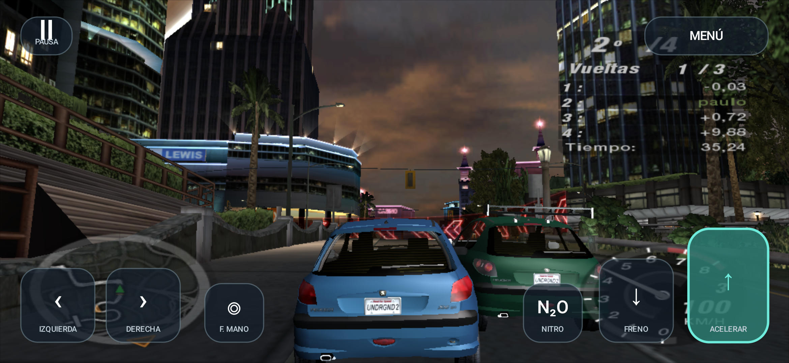
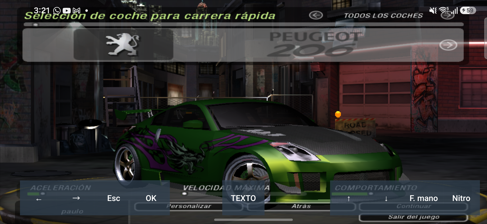
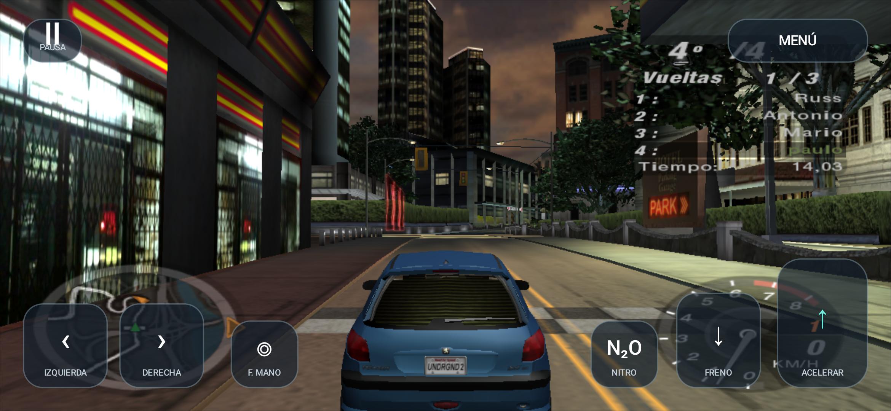
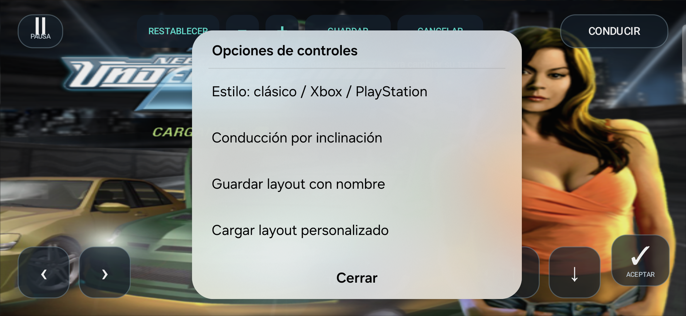
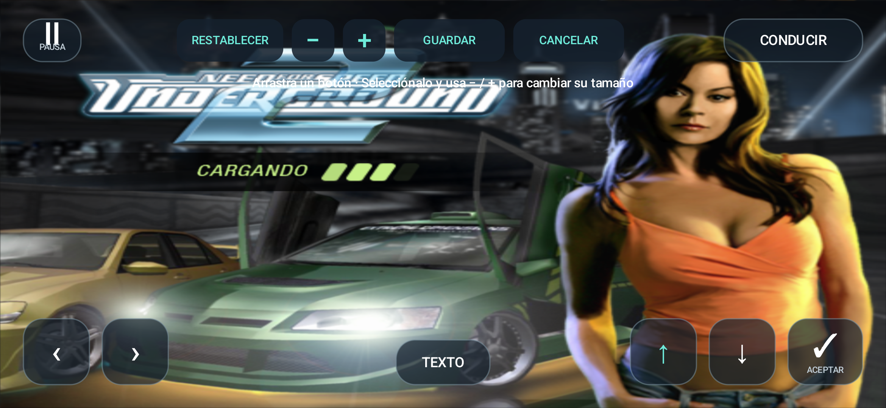
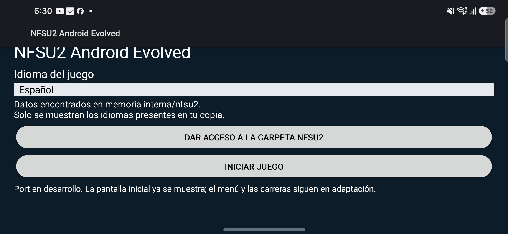

# Need for Speed Underground 2 — Recompiled

<div align="center">


### **Static Recompilation of SPEED2.EXE into Native C (x86 & ARM64)**

[](#status)
[-orange.svg)](#graphics--vulkan-runtime)
[](#audio--multimedia)
[](#status)
[-lightgrey.svg)](#legal)

*A full static binary recompilation of **Need for Speed: Underground 2** (`SPEED2.EXE`, x86-32) into clean, portable C code using an enhanced fork of [pcrecomp](https://github.com/sp00nznet/pcrecomp).*

[🎮 Android Showcase](#gameplay-showcase) • [⚡ Features](#features) • [📊 Status](#status) • [🛠️ Build Pipeline](#pipeline) • [📱 Android Guide](#android-port) • [⚖️ Legal](#legal)

---

</div>

## Gameplay Showcase

> Real-time screenshots captured running natively on **Android (ARM64)** with DXVK Native over Vulkan 1.3:

<div align="center">

| **In-Game Night Race (Overtake & HUD)** | **Car Customization & Tuning Garage** |
|:---:|:---:|
|  |  |
| *Real-time race against AI with active touch HUD & analog gauges* | *Full 3D vinyl, rim and chassis rendering in the garage* |

| **Driving Perspective & Telemetry** | **Customizable Touch Controls & Styles** |
|:---:|:---:|
|  |  |
| *Smooth 35–51+ FPS gameplay on Samsung Galaxy S24 Ultra (SM-S938B)* | *Live layout editor, button scaling, gyroscope tilt & layout presets* |

| **Interactive Button Layout Editor** | **Native Game Launcher & Settings** |
|:---:|:---:|
|  |  |
| *Drag, resize and save personalized control profiles* | *Automatic internal storage detection, language & FPS limits* |

</div>

---

## Features

- **⚡ Native Binary Recompilation**: Translates 27,700+ x86 functions into standard C code. No JIT compiler, no virtualization layer and no dynamic translation overhead at runtime.
- **📱 Android ARM64 Runtime**: Native execution on modern mobile devices with portable virtual memory management, structured exception handling and POSIX thread synchronization.
- **🌋 Vulkan Graphics Acceleration**: Full Direct3D 9 to Vulkan translation powered by an embedded port of DXVK Native.
- **🎮 Fully Customizable Touch Controls**:
  - Drag-and-drop on-screen controls editor with button scaling and persistent named layouts.
  - Preset control themes: *Clásico*, *Xbox*, and *PlayStation*.
  - Gyroscope / Tilt-based accelerometer steering for an intuitive driving experience.
  - Dedicated driving buttons: Steering, Handbrake, Nitrous (N₂O), Brake/Reverse, and Throttle.
- **🖥️ In-Game Resolution & FPS Scaler**:
  - Dynamic render resolution scaling (25%, 50%, 75%, Native Display, 720p).
  - Configurable frame rate limiters (Uncapped, 30 FPS, 60 FPS, 120 FPS) to balance thermals and battery endurance.
- **🔊 Low-Latency Audio**: Native PCM streaming using Android's AAudio backend with automatic buffer underrun protection.
- **🌐 Multilingual Support**: Detects and loads your game's language files (Spanish, English, French, German, Italian, etc.) directly from phone storage.

---

## Architecture Overview

```
                          ┌────────────────────────┐
                          │   SPEED2.EXE (x86)     │
                          └───────────┬────────────┘
                                      │
                         [ pcrecomp disasm32 ]
                                      │
                         [ lift32 (+ simd32) ]
                                      │
                          ┌───────────▼────────────┐
                          │  27,742 C Functions    │
                          │   (~8.9M lines C99)    │
                          └─────┬────────────┬─────┘
                                │            │
           ┌────────────────────┘            └────────────────────┐
           ▼                                                      ▼
 ┌──────────────────────┐                               ┌──────────────────────┐
 │     Windows Host     │                               │    Android ARM64     │
 │  MSVC x86 Toolchain  │                               │   Android NDK / C++  │
 │  Direct3D 9 / Win32  │                               │   DXVK Native/Vulkan │
 └──────────────────────┘                               └──────────────────────┘
```

> [!IMPORTANT]
> **This repository contains no copyrighted game code or assets.** You must own a legitimate copy of Need for Speed Underground 2 and provide your own game files. All generated code and analysis artifacts are produced locally on your machine.

---

## Status

Current state as of **October 2026**:

| Milestone / Component | Platform | Status | Details |
|---|---|:---:|---|
| **M0 C Generation** | Any | **DONE** | 27,742 functions, 8.9M lines of C, 0 lift failures |
| **M1 Compiles / M2 Links** | Windows | **DONE** | MSVC x86, 0 errors (~4.5 min on 16 threads) |
| **M3 CRT / M4 Entry / M5 WinMain** | Windows | **DONE** | Game startup runs fully recompiled (registry, timers, threads) |
| **M6 Window / M7 D3D9 / M8 First Frame** | Windows | **DONE** | Device initialization, window management and rendering |
| **M9 Intros / M10 Menus** | Windows | **WORKING** | FMVs play, menus render, full keyboard and controller input |
| **Car Rendering & Visuals** | Win / Android | **WORKING** | Fixed 16-bit signed flag bug; cars, vinyls and headlights render accurately |
| **Race Loading & Gameplay** | Win / Android | **PLAYABLE** | Resort Loop and Quick Races load; acceleration, steering, nitrous, AI traffic active |
| **ARM64 Android Port** | Android | **PLAYABLE** | 35–51+ FPS at 1170×540 on Snapdragon 8 Gen 3; touch controls and audio active |
| **Surface Recovery & Pause** | Android | **VERIFIED** | Clean background/resume without losing process or graphics state |
| **Frame Rate Limiter & Scaler** | Android | **DONE** | 30/60/120 FPS frame caps and dynamic resolution modes implemented |

---

## Tested Game Build

| Property | Details |
|---|---|
| **Binary File** | `SPEED2.EXE` (4,800,512 bytes) |
| **SHA-256 Checksum** | `f9dd86c054878ce6276beb07c1fd61874f7a1e4bf1f241b084c65b73e24168a7` |
| **Embedded Date** | `Feb 9 2005` (online `VERS` field) |
| **Binary Format** | Unpacked image (`.text` clean code, rebuilt imports, relocations preserved) |

*For deep binary details, see [docs/NFSU2_BINARY_REPORT.md](docs/NFSU2_BINARY_REPORT.md).*

---

## Requirements

### Windows Host
- Windows 10 / 11 64-bit
- Visual Studio 2022 / 2026 with C++ x86 desktop development toolset (MSVC)
- LLVM / Clang (for differential testing)
- Python 3.10+ with dependencies:
  ```bash
  pip install capstone pefile unicorn keystone-engine
  ```
- Enhanced pcrecomp submodule with patches 0001–0011 applied:
  ```bash
  git clone https://github.com/sp00nznet/pcrecomp.git ../pcrecomp
  cd ../pcrecomp
  git checkout 35548b8
  git am ../nfsu2-recompiled/patches/pcrecomp/*.patch
  ```

### Android Build
- Android SDK Platform 35 / Min SDK 26 (Android 8.0+)
- Android NDK (r25c or newer with Clang ARM64)
- Vulkan 1.3 capable Android device (Vulkan 1.1 fallback in development)

---

## Pipeline

Follow these steps to generate the C code and build the executable:

```bash
# 1. Initialize MSVC x86 environment in Git Bash
source scripts/vsenv.sh x86
GAME="/path/to/Need for Speed Underground 2"

# 2. Normalize executable (restores relocation directory without modifying original)
python scripts/normalize_exe.py "$GAME/SPEED2.EXE" work/SPEED2.analysis.exe

# 3. Scan seeds: vtables and RTTI
python ../pcrecomp/tools/cpp/vtable_scan.py work/SPEED2.analysis.exe --seeds work/vtable_seeds.json
python ../pcrecomp/tools/cpp/rtti.py        work/SPEED2.analysis.exe --seeds work/rtti_seeds.json

# 4. Generate function catalog with basic blocks (~5 min)
python scripts/run_lift.py catalog work/SPEED2.analysis.exe work/seeds_all.json work/catalog.json

# 5. Lift assembly to portable C (~90 s) -> src/recomp/gen/
python scripts/run_lift.py lift work/SPEED2.analysis.exe work/catalog.json src/recomp/gen

# 6. Build and run native Windows host
scripts/build.sh
scripts/run.sh [--fullscreen]
```

---

## Android Port

The `android/` directory contains the complete Gradle project for the Android APK:

1. **Building the APK**:
   ```bash
   cd android
   ./gradlew assembleDebug
   ```
2. **Device Deployment**:
   - Install the generated APK on your Android device.
   - Copy your PC game files (`Need for Speed Underground 2`) to the device's internal storage inside a folder named `/sdcard/nfsu2/`.
   - Open **NFSU2 Android Evolved**, grant file access, choose your preferred language, resolution, and FPS cap, and launch the game!

See additional documentation:
- [Android Port Status & Build Notes](docs/ANDROID_PORT.md)
- [DXVK Native Android Port](ports/dxvk_android/README.md)
- [Gameplay & Controls Validation](docs/ANDROID_GAMEPLAY_CONTROLS_TEST.md)
- [Menu & Save Profile Testing](docs/ANDROID_MENU_PROFILE_TEST.md)

---

## Patches Applied to pcrecomp

The project uses tailored patches over upstream pcrecomp located in `patches/pcrecomp/`:

| Patch | Name / Functionality |
|:---:|---|
| **0001** | `pe_analyze`: code range restricted to adjacent executable sections holding the entry point |
| **0002** | `lift32`: Complete MMX, SSE and SSE2 support via `simd32.py`; +40 SIMD difftest cases |
| **0003** | `RECOMP_STRICT_ICALL`: host dispatch hooks for unresolved indirect calls |
| **0004** | Lazy-flag `lahf` support and x87 environment save/restore |
| **0005** | Backward-branch yields for guest thread progress and cooperative multitasking |
| **0006** | Post-call instrumentation hooks and API tracing |
| **0007** | Pre-call hooks for native argument inspection and memory rewriting |
| **0008** | x87 TOP reporting, fair FIFO machine lock, and hashed symbol lookups |
| **0009** | Explicit sign handling for signed conditions (fixed race-loading crash and car rendering) |
| **0010** | `RECOMP_NATIVE_RANGE`: selective hybrid bisection execution against original code |
| **0011** | Thread-local xmm/mxcsr and guest CPU flag preservation per guest thread |

---

## Legal & Disclaimer

- Need for Speed, Underground, EA, and all associated game materials, logos, and trademarks are the property of **Electronic Arts Inc.**
- This project is a reverse engineering and static recompilation research initiative created for educational and archival purposes.
- All code authored in this repository (lifter tooling, Android bridge, WSI wrappers, launcher and scripts) is released under the **MIT License**.
- **No proprietary game binaries, copyrighted music, videos, or 3D models are distributed in this repository.**
